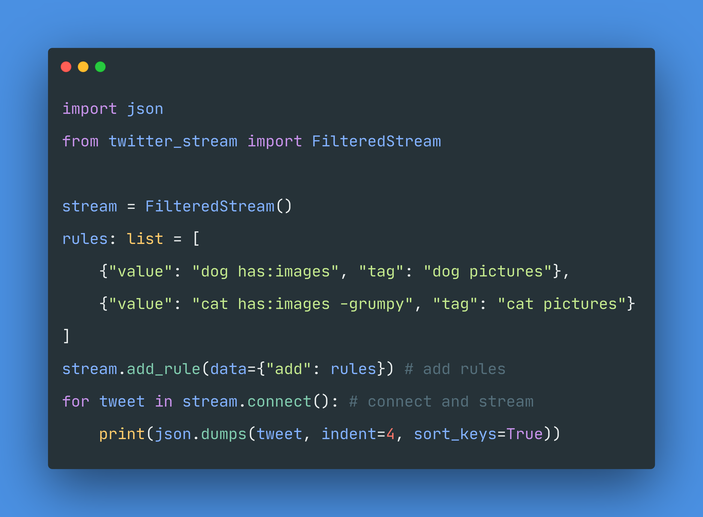

# twitter-stream.py
[](https://developer.twitter.com/en/docs/twitter-api)

# Sampled Stream

Construct cleaner and concise queries. Subclass SampledStream, name your desired query parameters, and assign their values in a list. twitter-stream.py will take care of the rest.
[Here are the list of query parameters](https://developer.twitter.com/en/docs/twitter-api/tweets/sampled-stream/api-reference/get-tweets-sample-stream)


# Recent Stream
Get Recent Stream Based on your queries. [Checkout the list of query parameters for Recent Stream](https://developer.twitter.com/en/docs/twitter-api/tweets/search/api-reference/get-tweets-search-recent)


# Filtered Stream



### Bearer Token
```
~$ export BEARER_TOKEN=BEARER TOKEN
```
### Adding Rules
```python
>>> import json
>>> from twitter_stream.twitter_stream import FilteredStream

>>> stream = FilteredStream()
>>> rules = {"add": [{'value': 'from: twitivitydev'}]}
>>> print(json.dumps(stream.add_rule(data=rules), indent=4))
```

### Deleting Rules
```python
>>> import json
>>> from twitter_stream.twitter_stream import FilteredStream

>>> stream = FilteredStream()
>>> response = stream.delete_rule({"delete": {"ids": ['1331486534579589120']}})
>>> print(response)
```

### Get Rules
```python
>>> import json
>>> from twitter_stream.twitter_stream import FilteredStream

>>> stream = FilteredStream()
>>> print(json.dumps(stream.get_rules(), indent=4, sort_keys=True))
```

### Stream
```python
>>> import json
>>> from twitter_stream.twitter_stream import FilteredStream

>>> stream = FilteredStream()
>>> for tweet in stream.connect():
       print(json.dumps(tweet, indent=4))
```

## Installation
```bash
~$ pip3 install twitter-stream.py
```

# Documentation
Read the documentation at [twitivity.dev/docs](https://twitivity.dev/docs/twitter-stream.py/)

<hr>

# Support
```  
Please consider supporting this repository. 

BTC: bc1q2t4zv83g20u8gt2ly2cquwr57eawqxus092jwu
ETH: 0xf6169c013ac11eEFD5e87A60F8ED31AA75D874a7 
```
